# 心植 HeartPlant 数据 ER 图

> 数据主要存储在 **Supabase**：认证用 Auth，业务数据用 PostgreSQL 表 `kv_store_4b732228`（key-value）及可选的 `profiles`、`user_roles`。  
> 下图为**逻辑实体关系**，KV 中通过 key 前缀区分实体类型。

---

## 1. Mermaid ER 图（逻辑模型）

```mermaid
erDiagram
    %% ========== 认证与用户 ==========
    AUTH_USERS {
        string id PK "Supabase Auth"
        string email
        json user_metadata "name, avatar, role..."
    }

    PROFILES {
        string id PK "= auth.users.id"
        string email
        string name
        string avatar
        string bio
        string location
    }

    USER_ROLES {
        string user_id PK
        string role "admin | user"
    }

    STATS {
        string user_id PK "stats:userId"
        int level
        int exp
        int totalPosts
        int totalLikes
        int totalComments
        int waterCount
        int fertilizerCount
        int plantsAdopted
        int loginStreak
        json achievements
    }

    %% ========== 植物库与认领植物 ==========
    LIBRARY {
        string id PK "library:id, 品种ID"
        string name "品种名"
        string species "品种"
        string type "观叶/多肉/芳香..."
        string imageUrl
        string scene "family|love|friend|solo"
        json dimensions "healing, companion, vitality"
        json tags
    }

    PLANT {
        string id PK "plant:libraryId-timestamp"
        string libraryId FK "-> LIBRARY.id"
        string name "用户命名"
        string species "来自库"
        string cartoonImageUrl
        json ownerEmails "多主共养"
        json ownerIds "多主共养"
        datetime adoptedAt
    }

    %% ========== 心情与日记 ==========
    MOOD {
        string id PK "mood:plantId:timestamp"
        string plantId FK "-> PLANT.id"
        string userId FK "-> AUTH_USERS.id"
        string emotion "情感状态"
        string content
        json activityTags
        datetime created_at
    }

    JOURNAL {
        string id PK "journal:plantId:timestamp"
        string plantId FK "-> PLANT.id"
        string userId FK "-> AUTH_USERS.id"
        string title
        string content
        string style "写作风格"
        datetime created_at
    }

    %% ========== 动态与社交 ==========
    MOMENT {
        string id PK "moment:..."
        string userId FK "-> AUTH_USERS.id"
        string plantId FK "-> PLANT.id"
        string content
        string imageUrl
        int likes
        datetime created_at
    }

    COMMENT {
        string id PK "comment:momentId:..."
        string momentId FK "-> MOMENT.id"
        string userId FK "-> AUTH_USERS.id"
        string content
        datetime created_at
    }

    FOLLOW {
        string key PK "follow:followerId:targetUserId"
        string followerId FK "-> AUTH_USERS.id"
        string targetUserId FK "-> AUTH_USERS.id"
        string followerName
        string followerAvatar
        datetime createdAt
    }

    %% ========== 邀请与通知 ==========
    INVITE {
        string code PK "invite:code"
        string plantId FK "-> PLANT.id"
        string inviterId FK "-> AUTH_USERS.id"
        string inviterName
        datetime timestamp
    }

    NOTIFICATION {
        string id PK "notification:email:code"
        string from "发件人名称"
        string inviteCode FK "-> INVITE.code"
        datetime timestamp
    }

    %% ========== 活动与时间轴 ==========
    ACTIVITY {
        string id PK "activity:plantId:timestamp"
        string plantId FK "-> PLANT.id"
        string actionType "watering|fertilizing..."
        string userName
        json details
        datetime timestamp
    }

    TIMELINE {
        string plantId PK "timeline:plantId 缓存"
        json events "聚合 mood/journal/activity"
    }

    %% ========== 关系 ==========
    AUTH_USERS ||--o| PROFILES : "可选同步"
    AUTH_USERS ||--o| USER_ROLES : "可选"
    AUTH_USERS ||--|| STATS : "1:1"
    LIBRARY ||--o{ PLANT : "品种 -> 认领实例"
    AUTH_USERS ||--o{ PLANT : "ownerIds/ownerEmails"
    PLANT ||--o{ MOOD : "按植物"
    PLANT ||--o{ JOURNAL : "按植物"
    AUTH_USERS ||--o{ MOOD : "userId"
    AUTH_USERS ||--o{ JOURNAL : "userId"
    AUTH_USERS ||--o{ MOMENT : "发布"
    PLANT ||--o{ MOMENT : "可选关联"
    MOMENT ||--o{ COMMENT : "评论"
    AUTH_USERS ||--o{ COMMENT : "userId"
    AUTH_USERS ||--o{ FOLLOW : "followerId"
    AUTH_USERS ||--o{ FOLLOW : "targetUserId"
    PLANT ||--o{ INVITE : "邀请共养"
    AUTH_USERS ||--o{ INVITE : "inviterId"
    INVITE ||--o{ NOTIFICATION : "inviteCode"
    PLANT ||--o{ ACTIVITY : "浇水/施肥"
    PLANT ||--o| TIMELINE : "缓存"
```

---

## 2. 全量字段清单（按实体）

以下为代码中实际出现或归一化输出的**全量字段**，便于对照接口与存储。

### 2.1 AUTH_USERS（Supabase Auth）

| 字段 | 类型 | 说明 |
|------|------|------|
| id | string | 主键，Supabase 用户 ID |
| email | string | 邮箱 |
| user_metadata | object | name, avatar, bio, location, role 等 |

---

### 2.2 PROFILES（表 profiles + KV profile:userId）

| 字段 | 类型 | 说明 |
|------|------|------|
| id | string | = auth.users.id |
| email | string | 邮箱 |
| name | string | 昵称/显示名 |
| avatar | string | 头像 URL |
| bio | string | 简介 |
| location | string | 地区 |
| role | string | 解析自 user_metadata 或 user_roles 表 |
| updated_at | string | ISO 时间，仅 KV 覆盖时有 |
| source | string | "auth+kv" | "kv"，仅 KV 覆盖时有 |

---

### 2.3 USER_ROLES（表 user_roles，可选）

| 字段 | 类型 | 说明 |
|------|------|------|
| user_id | string | 用户 ID |
| role | string | admin \| user |

---

### 2.4 STATS（KV stats:userId）

| 字段 | 类型 | 说明 |
|------|------|------|
| userId | string | 用户 ID |
| level | number | 等级 |
| exp | number | 经验值 |
| totalPosts | number | 发帖数 |
| totalLikes | number | 获赞数 |
| totalComments | number | 评论数 |
| waterCount | number | 浇水次数 |
| fertilizerCount | number | 施肥次数 |
| plantsAdopted | number | 认领植物数 |
| loginStreak | number | 连续登录天数 |
| achievements | string[] | 已解锁成就 ID 列表 |

---

### 2.5 LIBRARY（KV library:id）

| 字段 | 类型 | 说明 |
|------|------|------|
| id | string | 品种 ID（主键） |
| libraryId | string | 同 id |
| originalId | string | 同 id |
| name | string | 品种名/展示名 |
| species | string | 品种（与 name 可能同义，来自库） |
| type | string | 观叶植物/多肉植物/芳香植物 等 |
| difficulty | string | easy / medium / hard |
| scene | string | family / love / friend / solo |
| description | string | 描述 |
| imageUrl | string | 图片 URL（image/coverImage/cover 归一化为此） |
| image | string | 同 imageUrl |
| coverImage | string | 同 imageUrl |
| tags | string[] | 标签，如 ["净化空气","耐阴"] |
| addedDate | string | 入库日期 YYYY-MM-DD |
| created_at | string | ISO 时间 |
| createdAt | string | ISO 时间 |
| habits | string | 养护习性 |
| lifespan | string | 寿命描述 |
| emotionalMeaning | string | 情感寓意 |
| dimensions | object | { healing, companion, vitality } 数值 |
| plantId | string | 可选，兼容用 |
| customPrompt | string | 卡通图生成用自定义 prompt（可选） |

---

### 2.6 PLANT（KV plant:libraryId-timestamp）

| 字段 | 类型 | 说明 |
|------|------|------|
| id | string | 主键，如 plant:银皇后-1731234567890 |
| plantId | string | 同 id |
| libraryId | string | 品种 ID → Library.id |
| originalId | string | 同 libraryId |
| sourcePlantId | string | 同 libraryId |
| name | string | 用户命名（昵称）；空则前端用品种回退 |
| species | string | 品种名（来自库） |
| imageUrl | string | 图片（image/coverImage 归一化） |
| image | string | 同 imageUrl |
| coverImage | string | 同 imageUrl |
| cartoonImageUrl | string | 认领生成的卡通图 URL |
| ownerEmails | string[] | 主养人邮箱列表（小写） |
| ownerIds | string[] | 主养人用户 ID 列表 |
| owners | string[] | 主养人显示名列表 |
| adoptedAt | string | 认领时间 ISO |
| created_at | string | ISO 时间 |
| createdAt | string | ISO 时间 |
| addedDate | string | 日期 YYYY-MM-DD |
| tags | string[] | 标签 |
| dimensions | object | { healing, companion, vitality } |
| health | number | 健康值 0–100（浇水/施肥会更新） |

**认领后命名规则**：用户修改「植物命名」时，仅可更新 `name` 字段；`species`（品种）由认领时的植物库决定，**不可通过命名接口修改**。接口：`PATCH /plants/:id`，body：`{ "name": "用户起的名字" }`。

---

### 2.7 MOOD（KV mood:plantId:timestamp）

| 字段 | 类型 | 说明 |
|------|------|------|
| id | string | 主键，如 mood:plantId:1731234567890 |
| plantId | string | 植物 ID |
| libraryId | string | 品种 ID |
| originalId | string | 品种 ID |
| mood | string | 情感状态 |
| content | string | 内容 |
| tags | string[] | 活动标签 |
| timestamp | string | 前端传入时间 |
| created_at | string | 服务端写入 ISO 时间 |
| userId | string | 记录人用户 ID |

---

### 2.8 JOURNAL（KV journal:plantId:timestamp）

| 字段 | 类型 | 说明 |
|------|------|------|
| id | string | 主键 |
| plantId | string | 植物 ID |
| libraryId | string | 品种 ID |
| originalId | string | 品种 ID |
| title | string | 标题 |
| style | string | 写作风格 |
| entries | array | 多段落内容（结构由前端定） |
| timestamp | string | 前端传入时间 |
| created_at | string | 服务端写入 ISO 时间 |
| userId | string | 记录人用户 ID |
| isFeatured | boolean | 是否精选（管理员可切换） |
| featuredAt | string | 设为精选时间 ISO，取消时 null |

---

### 2.9 MOMENT（KV moment:timestamp）

| 字段 | 类型 | 说明 |
|------|------|------|
| id | string | 主键，如 moment:1731234567890 |
| userId | string | 发布者用户 ID |
| user | string | 发布者显示名 |
| avatar | string | 首字母等，展示用 |
| content | string | 正文 |
| image | string | 图片 URL |
| tag | string | 如 "成长日志" |
| likes | number | 点赞数 |
| comments | number | 评论数 |
| created_at | string | ISO 时间 |
| plantId | string | 可选，关联植物 |

---

### 2.10 COMMENT（KV comment:momentId:timestamp）

| 字段 | 类型 | 说明 |
|------|------|------|
| id | string | 主键，如 comment:momentId:1731234567890 |
| momentId | string | 瞬间 ID |
| userId | string | 评论者用户 ID |
| user | string | 评论者显示名 |
| content | string | 评论内容 |
| created_at | string | ISO 时间 |

---

### 2.11 FOLLOW（KV follow:followerId:targetUserId）

| 字段 | 类型 | 说明 |
|------|------|------|
| id | string | = key |
| followerId | string | 关注者用户 ID |
| followerName | string | 关注者昵称 |
| followerAvatar | string | 关注者头像 |
| targetUserId | string | 被关注用户 ID |
| targetUserName | string | 被关注用户昵称 |
| targetUserAvatar | string | 被关注用户头像 |
| timestamp | string | ISO 时间 |

---

### 2.12 INVITE（KV invite:code）

| 字段 | 类型 | 说明 |
|------|------|------|
| code | string | 邀请码（key 中） |
| plantId | string | 植物 ID |
| inviterId | string | 邀请人用户 ID |
| inviterName | string | 邀请人昵称 |
| timestamp | string | ISO 时间 |

---

### 2.13 NOTIFICATION（KV notification:email:code）

| 字段 | 类型 | 说明 |
|------|------|------|
| id | string | = key，如 notification:xxx@qq.com:ABC123 |
| from | string | 发件人名称 |
| inviteCode | string | 邀请码 |
| timestamp | string | ISO 时间 |

---

### 2.14 ACTIVITY（KV activity:plantId:timestamp）

| 字段 | 类型 | 说明 |
|------|------|------|
| id | string | 主键 |
| plantId | string | 植物 ID |
| libraryId | string | 品种 ID |
| originalId | string | 品种 ID |
| actionType | string | watering / fertilizing 等 |
| userName | string | 操作人显示名 |
| details | object | 扩展信息 |
| timestamp | string | ISO 时间 |

---

### 2.15 LOG（KV log:plantId:timestamp_xxx，seed-batch 写入）

| 字段 | 类型 | 说明 |
|------|------|------|
| id | string | = key |
| plantId | string | 植物 ID |
| userId | string | 用户 ID |
| created_at | string | ISO 时间 |
| （其余由前端/批量为准） | - | 与 mood/journal 等结构可能复用 |

---

### 2.16 TIMELINE（KV timeline:plantId，缓存）

| 字段 | 类型 | 说明 |
|------|------|------|
| plantId | string | 植物 ID（key 中） |
| events | array | 聚合后的 mood/journal/activity 等时间线条目 |

---

## 3. KV Key 约定（kv_store_4b732228）

| 前缀 / 模式 | 说明 | 主要关联 |
|-------------|------|----------|
| `library:*` | 植物库品种 | - |
| `plant:*` | 用户认领的植物 | libraryId → Library；ownerIds/ownerEmails → User |
| `profile:*` | 用户资料覆盖（合并 Auth + profiles 表） | id = User.id |
| `stats:*` | 用户等级/成就/统计 | key = stats:userId |
| `mood:plantId:*` | 心情记录 | plantId → Plant；userId → User |
| `journal:plantId:*` | 合写日记 | plantId → Plant；userId → User |
| `moment:*` | 瞬间/动态 | userId → User；plantId → Plant |
| `comment:momentId:*` | 评论 | momentId → Moment；userId → User |
| `follow:followerId:targetUserId` | 关注关系 | 两个 User |
| `invite:code` | 邀请码 | plantId → Plant；inviterId → User |
| `notification:email:*` | 站内通知 | inviteCode 等 |
| `activity:plantId:*` | 浇水/施肥等活动 | plantId → Plant |
| `timeline:plantId` | 时间轴缓存 | plantId → Plant |

---

## 4. 存储分层小结

- **Supabase Auth**：用户账号（id, email, user_metadata）。
- **PostgreSQL 表**：
  - `kv_store_4b732228(key, value)`：上表所有业务 KV 数据。
  - `profiles`（可选）：与 Auth 同步的公开资料。
  - `user_roles`（可选）：角色。
- **Supabase Storage**：上传图片等（如 snapshot bucket）。

上图表达的是**逻辑实体及关系**，实际读写均通过 KV 的 key 前缀与 value 中的外键字段（如 plantId、userId、libraryId）实现。
